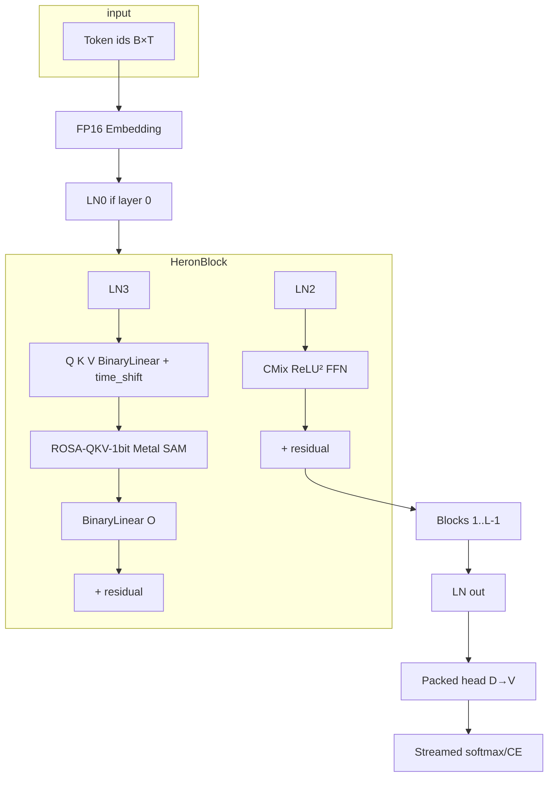
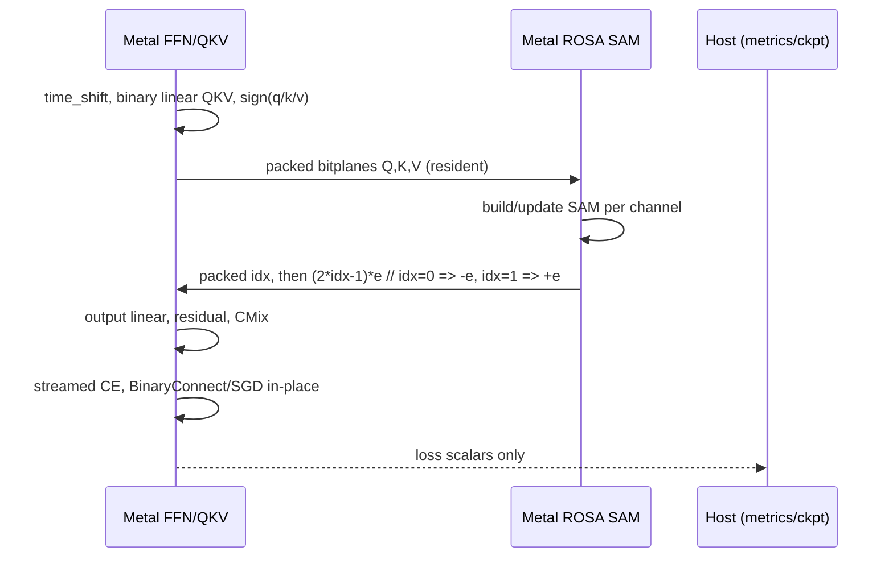

# Ullis RWKV-8 (Heron / ROSA): необратимая миграция с dense ternary Hyena

| Поле | Значение |
|---|---|
| **Документ** | Полная спецификация миграции Ullis v0.9.0 → RWKV-8 |
| **Автор** | Ullis maintainers (draft, ветка `rwkv8-port`) |
| **Дата** | 2026-08-27 |
| **Статус** | Draft |
| **Ветка** | `rwkv8-port` |
| **Целевое железо** | MacBook Pro M1 2020, 8 ГиБ unified memory |
| **Источники истины** | `/Users/vladislavkalinkin/ullis` (продукт), `/Users/vladislavkalinkin/RWKV-v8` (алгоритм) |

---

## Overview

Ullis v0.9.0 — Rust/Metal движок **dense ternary Hyena** с FP16-мастерами, packed-ternary проекциями, overlap-save FFT, двухгоризонтным MTP (`t+1`, `t+2`) и clipped SGD. На M1 8 ГиБ обучение упирается в GPU↔CPU и FFT-workspace: loss не опускается ниже ~9 (случайный `ln(V)` при `V≈8192`). Это не «ещё не докрутили learning rate», а архитектурный потолок свёртки на unified memory.

Предлагается **жёсткий разрыв**: удалить Hyena, implicit filter, FFT-шейдеры, персистентные FP16 ternary masters в чекпоинте и MTP-голову `t+2` без слоя совместимости. На их место ставится **RWKV-8 «Heron»** в том виде, в каком он реально существует в `/Users/vladislavkalinkin/RWKV-v8`: stacked блоки `LayerNorm → ROSA-QKV-1bit → ChannelMix x070`, опционально гибрид `RWKV-7 TimeMix + ROSA` для арифметических демо.

Персистентный файл — packed ±1 (где это оправдано) плюс FP16-векторы (LN, bias, time-shift, ROSA `e`, эмбеддинг, и матрицы с нулевым init). Это **не** «вся модель 1-bit» и **не** официальный trainer BlinkDL. Обучение packed-матриц — BinaryConnect: **FP16 latent всех packed-матриц живёт в RAM на время процесса** (не в checkpoint); `g_w` — одна переиспользуемая матрица. Автомат ROSA и линейные слои живут в Metal. Хост-трафик: token ids, скаляры loss, checkpoint I/O; packed Q/K/V bitplanes (`3·B·T·D/8`) только если включён CPU-оракул SAM.

Продуктовый контур Ullis сохраняется: crate `ullis`, CLI `train | tokenize | inspect | generate | chat`, byte-level BPE, JSONL с обязательным `assistant.thinking`, `metrics.jsonl`, resume, greedy decode, CPU-оракул для тестов.

---

## Background & Motivation

### Текущее состояние Ullis (v0.9.0)

Архитектура (`src/model.rs`, `src/hyena.rs`, `src/metal.rs`, `src/metal/hyena.metal`):

- tied embedding / output table (`Fp16Storage`);
- стек causal Hyena: RMSNorm → packed ternary `D→2D` → implicit filter FFT → tanh-gate → ternary `D→D`;
- две независимые ternary MTP-головы;
- персистентность: IEEE-754 binary16 masters (`src/precision.rs`), inference-коды — две bitplanes `{+1,0,−1}` (`PackedTernary` в `src/model.rs`);
- updater CLI: `train_step_metal_resident_stateless_sgd` / `train_step_stateless_sgd` (не Lion, несмотря на `train_config.json`);
- `unsafe_code = "deny"` в `Cargo.toml`; Metal FFI — разрозненные `#[allow(unsafe_code)]` вокруг `MTLBuffer::contents()` в `src/metal.rs`.

Известный bottleneck (README + `UllisHyena::hidden_metal_backward_update_resident`):

> The current exact filter-backward bridge reads compact `O(D*order)` filter parameters/statistics at a Metal update boundary.

При `train_filters=true` путь скачивает `freq/phase/decay`, генерирует фильтр на CPU (`ImplicitFilter::generate`) и гоняет `backward_prefix` на хосте. Даже в «резидентном» шаге FFT-спектры фильтра и `[B,T,D]` рабочие буферы раздувают unified memory. `TrainConfig::memory_estimate` резервирует `metal_hyena_workspace` (два signal FFT, два filter FFT, семь `[B,T,D]` FP32 gate/projection буферов). При `D=256`, `kernel=chunk=2048` это доминирует бюджет — не веса.

Checkpoint `format_version: 1` (`ModelCheckpoint` в `src/model.rs`) хранит `embedding_bits`, ternary `master_bits`, `freq/phase/decay`. После миграции эти файлы **нечитаемы**.

### Что такое RWKV-8 по официальному дереву (не по маркетингу)

`/Users/vladislavkalinkin/RWKV-v8/README.md` называет работу **RWKV-8 "Heron" with ROSA (Rapid Online Suffix Automaton)**. В дереве нет одного канонического trainer'а 0.1B; есть набор исследовательских скриптов.

| Файл | Что это на самом деле |
|---|---|
| `260212_rosa1bitLM_L12.py` | LM-инференс **pure ROSA1bit + FFN (no RWKV)**, `n_layer=12`, `n_embd=768`, `vocab_size=65536`, `DTYPE=torch.half`. Комментарий: «only trained on minipile (1.5B tokens)». Loss чекпоинта в имени: `loss3dot81`. |
| `260222_rosa4bitLM_L12.py` | Тот же каркас, ROSA-4bit (группы по 4 бита → 16-символьный алфавит). Чекпоинт `loss3dot44`. |
| `251014_rosa_onlyemb_train.py` | `Emb_ROSA` на token ids + Linear head. AdamW. README: loss ~0.65. |
| `251014_rosa_1bit_train.py` | `Emb_ROSA` + `ROSA_1bit_LAYER`. Backward помечен `!!! extremely slow !!!` — конечные разности по flip каждого бита. README: loss ~0.4. |
| `251014_rosa_1bit_layer.py` | Изолированный слой + численный тест `B,T,C = 1,5,3`. |
| `251016_rosa_1bit_run.py` | 2-слойный 1-bit ROSA demo (инференс). |
| `251018_rosa_4bit_run.py` | 4-слойный 4-bit ROSA demo. README: loss ~0.25 (train-скрипт `251018_rosa_4bit_train.py` в этом дереве **отсутствует**). |
| `251024_rosaQKV_run.py` | Гибрид **RWKV-7 TimeMix + ROSA-QKV-1bit + FFN**. Арифметика ±, V=13, C=128, T=129. README: ~1M params, 40 digits, 99% digit accuracy, **без CoT**. |
| `251105_reverse_run.py` | Тот же гибрид, reverse digits. L2-D32, **39.6K params**, 1–60 digits 99.8%. Отдельный чекпоинт `260123_reverse_L2_only_rwkv7`: **pure RWKV-7, ROSA output = 0**, 100% при более длинном обучении. |
| `cuda/wkv7_cuda.cu`, `cuda/wkv7_op.cpp` | Алгоритм WKV7 (`WindBackstepping`): рекуррентный state `C×C` на голову, `CHUNK_LEN=16`, `HEAD_SIZE=16`. CUDA в продукт не идёт. |

ROSA в коде — не «рекуррентный слот» и не KV-cache. Это **онлайн-суффиксный автомат** над дискретной последовательностью.

Token-level (`rosa()` в `251014_rosa_1bit_train.py`):

\[
y_i = x_{j+1} \text{ для longest suffix match } x_{j-m:j}=x_{i-m:i-1},\ \text{иначе } {-1}
\]

1-bit канал (`ROSA_1bit.forward`): `bits = (x>0)`; на каждом канале независимо строится `rosa(bits[b,:,c])`; выход `emb1` / `emb0` / `0` при idx ∈ {1,0,−1}.

QKV-1bit (`rosa_qkv_ref` / `samx_qkv_slow` в LM и reverse-скриптах): независимые 1-bit потоки Q, K, V; автомат пишется ключами K и читается запросами Q; возвращается бит V в позиции после матча. **Схлопывание `max(0,y)` действует на idx, не на float-выход:**

```python
return [max(0,y) for y in y]          # idx ∈ {0,1}: unmatched и matched-0 → 0, matched-1 → 1
out = (2.0 * idx.to(q.dtype) - 1.0) * e
# idx=0 → (0-1)*e = −e
# idx=1 → (2-1)*e = +e
```

4-bit (`260222_rosa4bitLM_L12.py`) — **другой контракт**: matched 1 → `+e`, matched 0 → `−e`, **unmatched → 0** (не `−e`). Нельзя переиспользовать формулу `(2·idx−1)·e` после collapse idx. 4-bit **не входит в 0.10**.

Блок Heron LM (`Block` в `260212_rosa1bitLM_L12.py`):

```
x = ln0(x)          # только layer 0
x = x + rosa(ln3(x))
x = x + ffn(ln2(x))
```

`RWKV_ROSA_1bit`: time-shift `xx = x_{t-1} - x_t`; `q,k,v = x + xx * x_{q,k,v}`; четыре `nn.Linear(C,C)`; `rosa_qkv`; `o`.

`RWKV_CMix_x070`: `k = relu(key(x + xx * x_k))^2`; `return value(k)`; `dim_ffn = n_embd * 4`.

Гибрид арифметики (`251024` / `251105`):

```
xr = rosa(ln_c(x))
xx, v_first = rwkv7_tmix(ln_a(x), v_first)
x = x + xx + xr
x = x + ffn(ln_b(x))
```

WKV7 forward (`wkv7_cuda.cu`):

```
w_i = exp(-exp(w_i))
sa  = Σ_j a_j * state_j
state_j = state_j * w_j + sa * b_j + k_j * v
y += state_j * q_j
```

Официальный 0.1B trainer **в этом дереве отсутствует**. Trainable bwd — только single-stream `ROSA_1bit`, не QKV. Сообщество (`wind_rosa` и др.) — truncated dict, не `rosa_qkv_ref`; в 0.10 не runtime. BlinkDL про CPU ROSA параллельно GPU — не лицензия тащить активации.

### Почему Hyena здесь закончилась

1. FFT overlap-save: workspace растёт как `O(D · fft_len)`, `fft_len ≈ 2·max(chunk,kernel)`. На M1 это конкурирует с OS за 8 ГиБ.
2. Filter-backward CPU bridge + frozen filter spectra (`main.rs` считает отдельные MiB для forward/backward FFT).
3. Ternary STE + stateless SGD по FP16 masters: градиент LM часто меньше ULP (`Fp16Storage::apply_clipped_sgd` даже имеет обход «сдвинуть на 1 ULP»). Loss ~9 = модель не учится.
4. Две MTP-головы удваивают tied-embedding градиент (`TIED_EMBEDDING_LR_SCALE = 0.01`).

ROSA+FFN убирает FFT целиком. State автомата — `O(T)` на канал, алфавит 1-bit = 2 ребёнка, без hashmap.

### Проверка технических ставок пользователя

| Ставка | Вердикт по `/Users/vladislavkalinkin/RWKV-v8` |
|---|---|
| Длина контекста не растит RAM так, как attention/Hyena | **Частично верно.** WKV7 inference state `O(H·N²)` не зависит от T (`N=16`). Training WKV7 пишет `s` формы `[B,H,T/CHUNK,N,N]` — линейно по T, но крошечно (D=256, T=2048 ≈ 2 МиБ/слой). ROSA — `O(T)` узлов на канал, **не** «RAM не растёт». На профиле M1 это десятки МиБ, не ГиБ. Hyena FFT и attention `O(T²)` — другой класс. |
| Можно учить 1-bit (−1,+1) модели без FP16/32 masters; качество близко к 4-bit | **Завышено.** «1-bit / 4-bit» в официальных скриптах — **ширина алфавита ROSA** (2 vs 16 символов на группу каналов), не квантизация весов. `nn.Linear`, `nn.Embedding`, `nn.LayerNorm`, `emb`/`emb0`/`emb1` — float (`half` на инференсе L12). Оптимизатор игрушечных trainer'ов — **AdamW**. Minipile: 1-bit loss 3.81 vs 4-bit 3.44 — 4-bit заметно лучше, не «почти то же». Toy copy: 0.65 / 0.4 / 0.25. Ullis **может** хранить линейные веса как packed ±1 без FP16-матрицы — это **наше** сжатие, не контракт BlinkDL. |
| Архитектура exact-in-memory; арифметика без CoT на ~1M и даже на нескольких тысячах параметров | **Почти верно, масштаб поправить.** `251024`: ~1M params, 40-digit ±, 99% digit accuracy, без CoT. `251105`: **39.6K**, не «few thousand». `260123_reverse_L2_only_rwkv7` даёт 100% **без ROSA** — exact memory не уникальна для ROSA. |
| Официальные алгоритмы существуют и их надо соблюдать | **Да, с оговоркой.** Forward ROSA/QKV/CMix/WKV7 и toy backward 1-bit — в дереве. Production trainer 0.1B и быстрый ROSA backward — нет (community). Metal-порт WKV7 обязан копировать `wkv7_cuda.cu`, не блог-формулы. |

---

## Goals & Non-Goals

### Goals

1. Удалить Hyena-стек без compatibility layer в **первом PR, который ещё собирается**: `src/hyena.rs`, `src/metal/hyena.metal`, Hyena-типы и тесты в `src/metal.rs` / `src/model.rs` / `lib.rs` / `config.rs` / CLI, плюс тонкий Metal runtime (device, `ffi.rs`, identity kernel) вместо FFT-модуля.
2. Реализовать Heron-блок по `260212_rosa1bitLM_L12.py` (ROSA-QKV-1bit + CMix x070) как **default train/generate/chat**.
3. Реализовать опциональный гибрид `rosa_rwkv7` по `251024_rosaQKV_run.py` / `251105_reverse_run.py` для eval арифметики и reverse. Digit-smoke сначала на **FP16** Tmix/FFN, не на packed ±1.
4. 1-bit ROSA как единственный ROSA в 0.10. 4-bit — post-0.10, после фикстур `rosa_slow_ref`.
5. Чекпоинт: нет FP16/FP32 **master-матриц**. Packed ±1 + learned scale (+ bias где у BlinkDL `bias=True`). RAM на время `train`/`generate`: FP16 latent **всех** packed-матриц (BinaryConnect, накапливается между шагами). `g_w` — одна матрица. Матрицы с `weight.zero_()` остаются FP16 в файле и в RAM. Accumulators FP32 — только эфемерные в шейдерах.
6. Metal-resident compute: веса, активации, CE, optimizer step, WKV7 state не покидают GPU. Нет MPS GEMM / материализации `[B,T,V]` в train. Разрешённый хост-трафик: token ids, скаляры loss, checkpoint I/O; packed Q/K/V (`3·B·T·D/8`) только CPU-оракул.
7. Сохранить CLI, BPE, JSONL, thinking-поле, greedy generate, chat, `metrics.jsonl`, resume.
8. CPU backend — детерминированный оракул (тесты, `--backend cpu`), не второй продукт.
9. Бюджет unified memory: **≤ 4.5 ГиБ** пик процесса; default `memory_budget_bytes = 4 ГиБ`.
10. Честный break чекпоинтов `format_version: 1`.

### Non-Goals

- Загрузка `.pth` BlinkDL / `rwkv_vocab_v20230424.txt` (65 536 токенов) как runtime-токенизатор Ullis.
- CUDA, Python trainer, dual-stack Hyena+RWKV в одном бинарнике.
- AdamW как default (официально используется, но 2×FP32 moments + мастер противоречат memory contract; опционально позже).
- MoE, KAN, tool execution (схема `tool_calls` остаётся как JSON-резерв).
- Sampling server, temperature/top-p в v1 generate (greedy остаётся; sample — follow-up, алгоритм есть в L12 скриптах).
- Сохранение `t+2` MTP как обязательного контракта.
- Bit-exact воспроизведение minipile 0.1B loss 3.81 на M1 (другой токенизатор, другой optimizer, другая персистентность весов).
- Реализация community ROSA-форков (`wind_rosa`, `qkv-rosa-fast-exact-backward`, …) как runtime. Их forward (усечённый dict над packed C-bit алфавитом) **не эквивалентен** `rosa_qkv_ref`. Не цитировать их как алгоритм Ullis, пока нет доказательства равенства idx с `rosa_qkv_ref` при `K=T`, 1-bit.
- 4-bit ROSA (`260222`) в релизе 0.10.
- Gate 0.10 на digit acc 90% при packed Tmix.

---

## Proposed Design

### Продуктовая архитектура (default): Heron LM

Имена типов — английские, как в коде.

```text
UllisHeron
  emb:     Fp16 table [V, D]          // единственная крупная непрерывная таблица
  blocks:  [HeronBlock; n_layers]     // ln0 живёт в blocks[0], не отдельный fused kernel
  ln_out:  LayerNorm [D]
  head:    PackedBinaryLinear D→V     // bias=False, как nn.Linear(..., bias=False) в RWKV()

HeronBlock
  ln0:      LayerNorm  // только layer_id==0; комментарий BlinkDL "should be fused with emb"
                       // значит «применять только на слое 0», не новый fused op
  ln3, ln2: LayerNorm
  rosa:     RwkvRosaQkv1Bit
  ffn:      RwkvCMixX070
```

`v_first` в официальном `Block.forward` создаётся и прокидывается, но **Heron LM его не использует** (нет TimeMix). В Ullis на `architecture = heron` тензор не выделяется.



### Опциональный гибрид: `architecture = rosa_rwkv7`

Нужен, чтобы не потерять арифметические/reverse результаты дерева. Не default.

```text
HybridBlock
  ln_a, ln_b, ln_c: LayerNorm
  tmix: RwkvTmixX070    // порт wkv7_cuda.cu
  rosa: RwkvRosaQkv1Bit
  ffn:  RwkvCMixX070
```

`v_first` — residual value с слоя 0, как в `RWKV_Tmix_x070.forward`.

### ROSA-QKV-1bit: алгоритм (обязательная копия `rosa_qkv_ref`)

Референс: `rosa_qkv_ref` в `260212_rosa1bitLM_L12.py` (идентичен `samx_qkv_slow` в reverse/QKV демо). Псевдокод не выдуман: это транскрипция.

Бинаризация (как `(x>0).to(torch.uint8)`): `bit = 1` iff `x > 0`; **`x == 0` → bit 0**.

На канал `c`, последовательности `q,k,v ∈ {0,1}^T` — пошаговая транскрипция `rosa_qkv_ref`:

1. Онлайн SAM на алфавите `{0,1}`: переходы пишутся по `k[i]`, match идёт по `q[i]`.
2. Сырое `y[i] = vvv[r[v]+1]` если найден узел с `m[v]>0` и `r[v]≥0`, иначе −1.
3. `idx[i] = max(0, y[i])` ∈ {0,1}. Unmatched и matched-0 дают **idx=0**, matched-1 даёт **idx=1**.
4. Float-выход слоя: `out[i] = (2·idx[i] − 1) · e[c]`. Следовательно **idx=0 → −e**, **idx=1 → +e**. Нет позиции с `out=0` на 1-bit QKV-пути.

Один CPU API для train и generate (запрет расхождения rebuild vs append). **Sentinel:** `trans0`/`trans1` — `i32`, отсутствие ребёнка = **`-1`**, не `0` (узел 0 — корень). `fail[0] = -1`. `new`: все `trans*` = −1, `fail` = −1, `maxlen` = 0, `last` = −1, `u=1` (следующий свободный узел), `g=w=h=0`.

Обязательная реализация `push` — построчная транскрипция тела цикла `rosa_qkv_ref` (`260212` lines 152–168) с `t[p][sym]` → `trans{0,1}[p]`:

```rust
struct RosaSam {
    trans0: Vec<i32>, trans1: Vec<i32>, // -1 = missing
    fail: Vec<i32>, maxlen: Vec<i32>, last: Vec<i32>,
    u: i32, g: i32, w: i32, h: i32, i: i32, // i = tokens already pushed
}
impl RosaSam {
    fn child(&self, p: i32, bit: u8) -> i32 {
        if p < 0 { return -1; }
        if bit == 0 { self.trans0[p as usize] } else { self.trans1[p as usize] }
    }
    fn set_child(&mut self, p: i32, bit: u8, to: i32) { /* trans0 or trans1 */ }
    /// Source of truth: rosa_qkv_ref loop body. Returns idx in {0,1}.
    fn push(&mut self, q_bit: u8, k_bit: u8, v_bit: u8) -> u8 {
        // 1) match on q (walk fail while child missing; clone-free query)
        // 2) y = vvv[last[v]+1] if found else -1; idx = max(0,y)
        //    vvv[t] is the v_bit pushed at step t — store v_hist[t] = v_bit
        // 3) insert node on k; split if maxlen[p]+1 != maxlen[d] (copy children)
        // 4) while v != -1 && last[v] < i { last[v] = i; v = fail[v] }
        // Python is the algorithm; this comment is the array contract.
        unimplemented!("copy 260212 rosa_qkv_ref; missing child is -1")
    }
}
```

PR 2 обязан вставить полный цикл, не «похоже на SAM». Тест: T `push` ≡ Python `rosa_qkv_ref` на тех же битах; фикстура QKV **и** `rosa()` T=5 C=3.

Метаданные автомата на канал, `N = 2T+1` (как `s=2*n+1` в Python):

| Массив | Смысл | Байты (i32) |
|---|---|---|
| `trans0[N]`, `trans1[N]` | дети 0/1 | `8N` |
| `fail[N]` | suffix link (`f`) | `4N` |
| `maxlen[N]` | `m` | `4N` |
| `last[N]` | `r` | `4N` |

Пик на канал ≈ `20N ≈ 40T` байт. Default `T=2048`, `D=256`: **≈ 21 МиБ на слой**. Train **перестраивает** SAM из трёх packed bitplanes (`3·B·T·D/8 = 192 КиБ/слой` при default, не 64). Пик — один слой, не L копий.

**Metal layout (1-bit):** один тред на `(b, c)`; `thread_id = b * D + c`. Глобальные буферы `trans0, trans1, fail, maxlen, last` формы `[B, D, N]` (или `[D, N]` при B=1), i32, missing child **`-1`**, `fail[*,*,0]=-1`, **не** hashmap, **не** threadgroup-local dict. Цикл `t = 0..T` последовательный в треде. Перестройка на каждом слое. Occupancy: ~`B·D` тредов (256 на default) — это **новый latency bottleneck вместо FFT**, не RAM. Бюджет времени: smoke `T=32` SAM fwd < 5 ms; default `T=2048` SAM fwd < 50 ms/слой на M1. Если превышено — профилировать, не уносить активации на CPU.

**CPU оракул:** тот же `RosaSam::push` для тестов и `--backend cpu`.

**4-bit:** не в 0.10. Официальный `rosa_slow_ref` — вложенный longest-match `O(T²)–O(T³)`, unmatched → float 0. 16-детный SAM можно сделать эквивалентным, но это отдельная реализация и отдельный выходной закон.

Token-level `Emb_ROSA` — **не** часть default Heron LM.



Запрещено: download `[B,T,D]` активаций, logits, optimizer state, full weight matrices. Если когда-либо понадобится CPU SAM (отладка 4-bit hashmap), через границу идут **только packed bits** — тот же класс, что старый `O(D·order)` filter bridge, не класс Hyena FFT.

### Градиент ROSA (честный контракт)

Официальное дерево **не содержит** backward для `rosa_qkv_1bit_layer_op` (`260212`: только `forward`, нет `save_for_backward`). Trainable bwd есть только у single-stream `ROSA_1bit` (`251014_rosa_1bit_layer.py`):

- `g_emb0 = Σ gy ⊙ 1_{idx=0}`, `g_emb1 = Σ gy ⊙ 1_{idx=1}`.
- `gx[t] = (φ(flip t→1) − φ(flip t→0)) / (2 max(|x_t|, τ))`, полный пересчёт `rosa()`, `τ=1e-3`.

`wind_rosa` — **другой forward** (truncated dict `d[k[j:i]]=v[i]`, packed C-bit алфавит, longest `q[j:i+1]`). Его CUDA scratch масштабируется с `(K+1)·…` и **не** является портом `rosa_qkv_ref`. Ullis **не** реализует wind_rosa как default SAM.

#### `g_e` (1-bit QKV) — точно, дешево

`out = (2·idx − 1)·e` на **каждой** позиции, включая idx=0:

```
g_e[c] = Σ_{b,t} gy[b,t,c] * (2 * idx[b,t,c] - 1)
```

Для idx=0 вклад `−gy`; для idx=1 вклад `+gy`. **Не** маскировать «ненулевой матч».

#### QKV `exact_bitflip` — написанный референс (CPU, T≤32)

Три независимых потока. Для канала `c`, потока `S ∈ {q,k,v}`, позиции `t`:

```
base_idx = rosa_qkv_ref(q_bits, k_bits, v_bits)           # {0,1}^T
φ(idx)   = Σ_u gy[u,c] * (2*idx[u] - 1) * e[c]           # = Σ gy * out / without extra mask

mag      = max(|S[t,c]|, τ)                              # τ = 1e-3
S1 = copy(S_bits); S1[t] = 1
S0 = copy(S_bits); S0[t] = 0
φ1 = φ(rosa_qkv_ref(... with S1 in the S slot ...))
φ0 = φ(rosa_qkv_ref(... with S0 in the S slot ...))
gS[t,c] = (φ1 - φ0) / (2 * mag)
```

Сложность `O(3 · T · D · cost_sam)`, `cost_sam = O(T)` → `O(T² D)` на последовательность. Только CPU tests / smoke. Тест: сравнить `gS` с этим референсом на T≤32; single-stream `ROSA_1bit` фикстура `B,T,C=1,5,3` остаётся **отдельным** тестом `rosa()` ≠ QKV.

STE через линейки Q/K/V (после `gS` на pre-sign активации) — обычный backward `Linear`/`PackedBinaryLinear` по `q,k,v` как по активациям.

#### Режимы `RosaGradMode`

| Режим | Когда | Что считается |
|---|---|---|
| `stop_grad_bits` | **default train 0.10** | Точный `g_e`. `gQ=gK=gV=0` **через автомат**. Нет пути к Q/K/V weights, bias, `x_q/x_k/x_v`, `ln3`. Честный **random-feature ROSA** (биты QKV заморожены после init) + обучаемый FFN/`o`/`e`. Лог `rosa_grad=stop_grad_bits`. |
| `exact_bitflip` | CPU, `T≤32`, unit tests | Формула выше. Единственный честный QKV bit-grad. Metal не обязан. |
| `linear_bitflip` | **не в 0.10**, follow-up | ≡ `exact_bitflip` на том же SAM. Не wind_rosa. |
| `ste_sign` | opt-in, **не default**, не BlinkDL | STE через `sign(q/k/v)` при **константном** idx (автомат stop-grad). Двигает QKV линейки без finite-diff. Только если пользователь явно хочет, чтобы QKV не были random features. |

Таблица train vs freeze при **default** `stop_grad_bits`:

| Тензор | Градиент в 0.10 default | Почему |
|---|---|---|
| ROSA `e` | да, `g_e` | `out=(2·idx−1)·e` |
| ROSA `o` weight/bias | да | после SAM, непрерывный |
| skip residual `x` | да | `x + o(y)` |
| CMix key/value, `x_k`, `ln2` | да | параллельная ветка |
| `emb`, `ln0`, `ln_out`, `head` | да | вокруг блока |
| ROSA `q,k,v` weight/bias | **нет** | SAM stop-grad |
| `x_q, x_k, x_v` | **нет** | только входы QKV |
| `ln3` | **нет** | только вход ROSA |

Smoke `loss < ln(V)` на крошечном V проверяет CMix+head+`o`+`e`, **не** что ROSA QKV учится. Это приемлемый деградированный trainer 0.10, если freeze-list явный (он здесь явный).

Scratch `exact_bitflip` на T=32, D=16: пренебрежимо. `linear_bitflip` не бюджетируется, пока нет алгоритма (не вписывать 21 МиБ SAM как замену bwd tape).

### WKV7 Metal (только `rosa_rwkv7`)

Порт `forward_kernel` / `backward_kernel` из `cuda/wkv7_cuda.cu`:

- `HEAD_SIZE = 16`, `CHUNK_LEN = 16` (как `load(..., _C_=16, _CHUNK_LEN_=16)`).
- `T % CHUNK_LEN == 0` на train; pad справа EOS, не менять CHUNK на лету.
- Accumulators `float`; хранение рекуррентного state — FP32 эфемерный буфер `[B,H,N,N]` на инференс, training tape `s: [B,H,T/CHUNK,N,N]`, `sa: [B,T,H,N]`.
- Остальная обвязка Tmix — полная транскрипция `RWKV_Tmix_x070.forward` (`251105_reverse_run.py`), не только CUDA kernel: `xx = time_shift(x)-x`; шесть lerp (`x_r…x_g`); `r,k,v = Linear`; `w = -softplus(-(w0 + tanh(xw@w1)@w2)) - 0.5`; value residual через `v_first` и `sigmoid(v0+(xv@v1)@v2)` для `layer_id>0`; `a = sigmoid(a0+(xa@a1)@a2)`; `g = sigmoid(xg@g1)@g2`; `kk = normalize((k*k_k).view(B,T,H,N), p=2)`; `k *= 1+(a-1)*k_a`; `RUN_WKV7(r,w,k,v, a=-kk, b=kk*a)`; `GroupNorm(H,C,eps=64e-5)`; extra term `((r*k*r_k).sum(-1) * v)`; `output(x * g)`.
- LoRA rank: **8** как `251105` (D=32); **16** как `251024` (D=128). Конфиг `tmix_lora_rank`: 8 если `d_model≤64`, иначе 16.
- WKV7 ядра считают в **FP32**; входы r/w/k/v/a/b — FP32 (из FP16 Tmix linears). Packed ±1 на Tmix R/K/V/O **нет** (см. таблицу тензоров).
- Pad `T % 16 == 0` для WKV-ядра. Официальные eval T=129 и T=257 суть `1 mod 16` — **не** подавать их в kernel. Буфер WKV: `T_wkv = ceil(T_script/16)*16` (144 / 272). Pad тем же токеном, что скрипт (`#` reverse, `=` plusminus, EOS chat). Digit-span accuracy на **непаднутом** участке (`p1`/`p2` как в Python). `TrainConfig.context_len` для hybrid train — 144/272/2048, **не** 129.

Инициализация ортогональных `w1/w2/...` и `output.weight.zero_()` копируется; это часть алгоритма.

#### Тензоры Tmix (на слой), `251105` L2 / `HEAD_SIZE=16`

| Имя | Shape (C=`d_model`, R=`tmix_lora_rank`, H=C/16, N=16) | Init | Ullis storage |
|---|---|---|---|
| `x_r,x_w,x_k,x_v,x_a,x_g` | `[1,1,C]` | `1 - ddd^p` (как скрипт) | FP16 |
| `w1,a1,v1,g1` | `[C,R]` | zeros | FP16 |
| `w2,a2,v2,g2` | `[R,C]` | `ortho_init(..., 0.1)` | FP16 |
| `w0,a0,v0` | `[1,1,C]` | zigzag/linear формулы | FP16 |
| `k_k,k_a` | `[1,1,C]` | `0.71-linear*0.1`, `1.02` | FP16 |
| `r_k` | `[H,N]` | `-0.04` | FP16 |
| `receptance,value` | `[C,C]` bias=False | `U(-0.5/√C, 0.5/√C)` | **FP16** |
| `key` | `[C,C]` bias=False | `U(-0.05/√C, 0.05/√C)` | **FP16** |
| `output` | `[C,C]` bias=False | **zeros** | **FP16** |
| `ln_x` | GroupNorm H groups | PyTorch default | FP16 γ/β |

При D=32 это килобайты; при D=256 Tmix — ~1 МиБ FP16 на слой, всё ещё ≪ FFT.

### Линейные слои и персистентность

Это **алгоритм Ullis**, не BlinkDL. Официальные `nn.Linear` — float; `RWKV_ROSA_1bit.q/k/v/o = nn.Linear(C,C)` имеют **bias=True** (дефолт PyTorch). CMix/Tmix/head — `bias=False`. Packed ±1 **не умеет 0**, поэтому матрицы с `weight.zero_()` нельзя паковать.

#### Таблица каждого `nn.Linear` / `nn.Parameter` (Heron `260212` + hybrid L2 `251105`)

| Модуль | Тензор | Shape | Bias | Official init | Ullis persistent |
|---|---|---|---|---|---|
| `RWKV.emb` | weight | `[V,D]` | n/a | default Embedding | **FP16** |
| `Block.ln0/ln2/ln3`, `ln_out` | weight, bias | `[D]` | — | 1, 0 | **FP16** |
| `RWKV_ROSA_1bit` | `x_q,x_k,x_v` | `[1,1,D]` | — | **zeros** | FP16 |
| `RWKV_ROSA_1bit` | `q,k,v,o` weight | `[D,D]` | **True** `[D]` | default Linear | packed ±1 + FP16 `scale[D]` + **FP16 bias[D]** |
| `rosa_qkv_1bit_layer` | `e` | `[1,1,D]` | — | **1.0** | FP16 |
| `RWKV_CMix_x070` | `x_k` | `[1,1,D]` | — | L12: `empty` (load); train: **zeros** | FP16 zeros |
| `RWKV_CMix_x070` | `key` | `[D, 4D]` | False | reverse: orthogonal `√4`; Heron: default | packed ±1 + scale |
| `RWKV_CMix_x070` | `value` | `[4D, D]` | False | reverse: **zeros** («useful») | **FP16** (нужен ноль) |
| `RWKV.head` | weight | `[V,D]` | False | default | packed ±1 + scale |
| Tmix R/K/V/O + LoRA | см. таблицу выше | | False | асимметричный | **всё FP16** |

Heron default (нет Tmix): CMix `value` FP16 — 6×512 КиБ = 3 МиБ. Packed QKVO+key — доли МиБ. Это сознательное отклонение: пакуем только там, где нет zero-init и матрица большая.

#### BinaryConnect на packed-матрицах (явное правило)

Это **классический BinaryConnect**, не «reconstruct ±scale каждый шаг». Discard latent после слоя = F1: знаки почти никогда не флипаются (`Δ ≈ lr ≪ scale`).

Персистентный файл / checkpoint v2 — **без** latent:

```
PackedBinaryLinear { bits: u32 words, row-major [out, in], bit 1 → +1, bit 0 → −1,
                     little-endian inside word, bit 0 of word 0 = weight[0,0];
                     scale: u16 IEEE binary16 [out];   // learned, not mean|latent|
                     bias: Option<u16[out]> }
```

RAM на жизнь процесса `MetalResidentHeronTrainingState` / CPU `UllisHeron` (не в JSON):

```
packed_latents: Fp16  // все packed-матрицы сразу: Q,K,V,O, CMix key, head
g_w:            f32   // ОДНА самая большая матрица, zeroed before each matrix
```

`max_matrix = max(D*D, D*4D, V*D)`. Default: head `V·D` доминирует → latent FP16 4 МиБ + `g_w` FP32 8 МиБ, плюс остальные latents ≈ 6 МиБ QKVO+key → `packed_latents ≈ 10 МиБ`.

Шаг для packed-матрицы **M** (latent[M] уже в RAM с прошлого шага):

1. `s[i,j] = sign(latent[i,j])` (`>=0` → +1). `bits` синхронизируются с `s` после шага для forward/ckpt.
2. Forward: `y_i = bias_i + scale_i * Σ_j s[i,j] * x_j` (FP32 MAC → FP16 y). **Не** `Σ latent * x`.
3. Backward STE (identity на `sign`):  
   `g_w[i,j] = gy_i * scale_i * x_j`  
   `g_x[j] += gy_i * scale_i * s[i,j]`  
   `g_scale[i] += gy_i * Σ_j s[i,j] * x_j`  
   `g_bias[i] += gy_i`.
4. `apply_clipped_sgd` на **persistent** `latent[i,j]` с `g_w` (ULP floor как `Fp16Storage`). Residual знака живёт между шагами.
5. `apply_clipped_sgd` на **learned** `scale` и `bias` по `g_scale`/`g_bias`.
6. Re-binarize bits from `sign(latent)` для следующего forward и для checkpoint. **Не** писать `scale = mean|latent|` — это убивает шаг 5. Один алгоритм масштаба: **learned `scale`**.
7. `g_w` zero и переиспользуется на следующей матрице. **`latent[M]` не уничтожается.**

Load checkpoint: `latent[i,j] ← scale[i] * s[i,j]` один раз, дальше только SGD. Save: bits+scale+bias, latent отбрасывается.

Init: Bernoulli ±1; `latent = scale * s` с `scale[i] = 1/sqrt(in)`; bias=0.

Smoke: `loss < ln(V)` на крошечном V проверяет updater CMix+head; при `stop_grad_bits` не доказывает обучение QKV.

Tied embedding **не** используем.

### Нормализация

Hyena RMSNorm (`ullis_rms_norm*`) **удалить**, не алиасить. Heron: `nn.LayerNorm`, `eps=1e-5`, init weight=1 bias=0. `ln0` — LayerNorm **только на layer 0**. Tmix `ln_x`: `GroupNorm(H, C, eps=64e-5)` только в гибриде.

### Loss, MTP, thinking

Официальные trainer/infer — **next-token CE**, один head.

- Default: streamed softmax/CE на `t+1`, без материализации `[B,T,V]` (сохраняем контракт `ullis_streamed_cross_entropy_fp16` / два прохода по vocab).
- MTP `t+2` **удаляется**. На ROSA суффиксный copy уже даёт многошаговую ассоциацию; вторая голова удваивала tied-grad и не имеет опоры в RWKV-v8.
- `MtpBatcher`: `time >= 2` вместо `>= 3`. Переименовать в `CausalBatcher` (breaking API crate).
- JSONL: `assistant.thinking` **остаётся обязательным** в `validate_record`. Сериализация как сейчас в `training_text()`: `<thinking>…</thinking>` внутри `<assistant>`. Это просто токены, не отдельный compute budget (как USAGE уже честно говорит про chat `--thinking`).
- Арифметика без CoT в RWKV-v8 **не отменяет** thinking в продуктовом датасете. `ullis eval-digits` — **две** задачи с конфигами из скриптов, не смешанный vocab:

| `--task` | Файл | V | TOK | T скрипта | T_wkv | C / layers | Accuracy |
|---|---|---|---|---|---|---|---|
| `plusminus` | `251024_rosaQKV_run.py` | 13 | `{0-9:+0-9, '+':10, '-':11, '=':12}` | 129, pad `=` | **144** | C=128, L4/L2 | digit-span `p1`/`p2` по `=`, без WKV-хвоста |
| `reverse` | `251105_reverse_run.py` | 12 | `{0-9, ',':10, '#':11}` | 129 или 257, pad `#` | **144** / **272** | C=32, L2 | digit-span как скрипт, не хвост `#` |

Не смешивать alphabets. Не ставить `context_len=129` (1 mod 16). `T_wkv = ceil(T_script/16)*16`. Сэмплинг — `get_randint`. Smoke 0.10: CPU **FP16** hybrid L2-D32 reverse 1–8 digits, не 90% gate.

### Tokenizer

Оставляем `src/tokenizer.rs`: byte-level BPE, ids `0..3` specials, `4..259` raw bytes, merges, `byte_bpe_v1`. Не тащим `RWKV_TOKENIZER` / `rwkv_vocab_v20230424.txt`. Default ceiling `DEFAULT_VOCAB = 8192` (можно 4096 через `--vocab-size` для ещё более мелких эмбеддингов).

### Generation / chat

Официальный L12 decode — «STUPIDLY SLOW (recompute everything…)». Ullis так делать не будет.

Один и тот же `RosaSam::push` на CPU. Metal train может rebuild из packed bits за T шагов `push` (или fused kernel); generate удерживает SAM.

```text
HeronGenerateState {
  per layer: RosaSam,           // trans0/1=-1 missing, fail[0]=-1, last, g, w, h, v_hist
              x_prev: [D] FP16, // time_shift input
  ln running: none (LN по одному токену = degenerate; для generate
              либо keep last T tokens hidden and LN over window — NO:
              LayerNorm in official L12 is over C at each position independently,
              so per-token LN is exact).
  hybrid extra: wkv_state [H,N,N] FP32, v_first [D]
}
```

Тест: T инкрементальных шагов vs one-shot `rosa_qkv_ref` на тех же битах — idx bit-exact. Greedy argmax. Chat UX без изменений.

### Memory: цифры под M1 8 ГиБ

Unified RAM делится с macOS, WindowServer, Metal driver. Целевой пик Ullis: **4.0–4.5 ГиБ**. Default admission: `memory_budget_bytes = 4 GiB` (**смена** с нынешних `DEFAULT_MEMORY_BUDGET_BYTES = 1 GiB` и `TrainConfig.default().context_len = 8192`). Рекомендация не ставить `--memory-budget-mib 8192` (README предлагает это вместе с несуществующим `config.toml` — **ошибка** на 8 ГиБ; файл конфигурации сейчас `train_config.json`).

#### Default profile `m1-8gb-heron`

| Параметр | Значение |
|---|---|
| `architecture` | `heron` |
| `d_model` | 256 |
| `n_layers` | 6 |
| `vocab_size` ceiling | 8192 |
| `context_len` | 2048 |
| `batch_size` | 1 |
| `dim_ffn` | 1024 (`4 * d_model`) |
| `rosa_bits` | 1 |
| `optimizer` | `stateless_sgd` |
| `rosa_grad` | `stop_grad_bits` |

Именованные поля `MemoryEstimate` (все через `checked_mul`, как сейчас в `config.rs`):

| Поле | Что входит | Default МиБ |
|---|---|---|
| `embedding` | `V·D·2` FP16 | 4.0 |
| `packed_bits_and_scales` | QKVO+CMix-key+**head** bits + scale + ROSA bias (`V·D/8` head = 256 КиБ) | ≈ 0.65 |
| `fp16_matrices` | CMix `value` `L·4D·D·2` | 3.0 |
| `ln_and_vec` | LN γ/β, `x_*`, `e` | < 0.1 |
| `act_checkpoints` | **список ниже** | ≈ 51 |
| `qkv_bitplanes` | `3·B·T·D/8` | 0.19 |
| `rosa_sam_peak` | `40·T·D` i32, один слой | 21 |
| `packed_latents` | FP16 **всех** packed матриц, жизнь процесса | ≈ 10 |
| `binaryconnect_workspace` | `g_w` FP32 одной матрицы `max(D², D·4D, V·D)` | **8** (head) |
| `ce_scratch` | streamed, `O(D+V)` reuse; **не** `[B,T,V]` | < 1 |
| `wkv_tape` | 0 на `heron` | 0 |
| `bwd_rosa_scratch` | 0 при `stop_grad_bits` | 0 |
| `command_slack` | heap | 32 |
| **Train peak** | sum | **≈ 130–170 МиБ** |
| OS+driver | не наше | 2.5–3.5 ГиБ |

Checkpoint-активации FP16 на слой (`B=T×D` байт ×2):

1. residual `x` `[B,T,D]`
2. `ln3(x)` `[B,T,D]`
3. `q,k,v` pre-sign `[B,T,D]×3`
4. ROSA `y` `[B,T,D]`
5. `ln2(x)` `[B,T,D]`
6. CMix `k` после ReLU² `[B,T,4D]`

Итого на слой: `8·BTD + 4·BTD = 12·B·T·D` FP16 = 12.6 МиБ; 6 слоёв ≈ **75 МиБ**, если держать все. Схема **переиспользования 2 слоёв** (как `activation_checkpoints: 2` сегодня) даёт ≈ 25 МиБ + recompute. Таблица выше берёт консервативные 51 МиБ (4 checkpoint-слоя). Не слоган «12·L·BTD», а этот список.

`contents()` на unified memory всё равно даёт cache traffic CPU/GPU. Residency CI ловит **staging blit и MPS GEMM**, не физический cache. Явно: **никакого `MPSMatrixMultiplication` в train** (сейчас `metal.rs` использует MPS для logits — удалить вместе с Hyena). Streamed CE — свои ядра, два прохода по vocab, буфер `[D]` / скаляры.

Вывод: **Hyena упиралась не в число параметров, а в FFT/readback.** После миграции 8 ГиБ с запасом держат default и даже официальный масштаб 0.1B, если не включать AdamW-masters.

#### Wide profile `m1-8gb-heron-0p1b` (не default, должен проходить admission)

`L=12, D=768, V=8192 (не 65536), T=512, B=1`, mixed packed QKVO/key + FP16 CMix value.

| Компонент | МиБ |
|---|---|
| Emb FP16 `8192×768` | 12 |
| Packed QKVO+key 12 слоёв | ≈ 6 |
| CMix value FP16 12×4D×D×2 | ≈ 56 |
| Acts (named checkpoint list × 12) | ≈ 113 |
| ROSA one-layer `40×512×768` | 16 |
| **Peak** | **< 250 МиБ** |

`V=65536` эмбеддинг FP16 = 96 МиБ + packed head 6 МиБ — всё ещё влезает. Не default: другой токенизатор, другая цель.

#### Если бы веса были FP16 как у BlinkDL L12 (для сравнения)

Матрицы ~10–170 МиБ. Всё ещё далеко от 4.5 ГиБ. Отказ от FP16-матриц — принцип Ullis и запас под будущий D, не условие выживания default-профиля.

#### 4-bit vs 1-bit RAM

Не в 0.10. Если позже: официальный путь — `rosa_slow_ref`, не «тот же SAM с 16 детьми» без фикстур. Оценка `trans[16][N]` ≈ 3–4× 1-bit SAM; layout тредов тот же `(b, g)` по группам из 4 каналов, не раздутый threadgroup на 16 детей в SIMD.

#### Optimizer RAM

| Kind | State | Default |
|---|---|---|
| `stateless_sgd` (CLI default, как `main.rs` ~358) | packed latents в RAM + `g_w` | ≈ 10 + 8 МиБ |
| `lion_fp16` | 1×FP16 momentum **только** на FP16 тензорах (emb, LN, bias, CMix value, Tmix) | ~7 МиБ |
| AdamW на FP16-матрицах | не предлагается | — |

`LionInt8Blockwise` удалить из enum (сейчас только budget-ложь; `train_config.json` его ставит, CLI игнорирует). `LionConfig { learning_rate, beta1, beta2, weight_decay }` **оставить** в `TrainConfig` для пути `lion_fp16`; CLI train по-прежнему форсирует `StatelessSgd`, если не передан `--optimizer lion-fp16`.

### Metal / unsafe

Сегодня `contents()` размазан по `src/metal.rs` (~40 unsafe-блоков). После миграции:

1. Крейтовый lint `unsafe_code = "deny"` **остаётся**.
2. Единственный exception: модуль `src/metal/ffi.rs` с `#![allow(unsafe_code)]`.
3. Разрешено: map/unmap `MTLBuffer::contents` для shared unified memory, `setBytes` скаляров, retain/release через `objc2`.
4. Запрещено: unsafe в модели, ROSA CPU, tokenizer, optimizer.
5. Шейдеры: `src/metal/rwkv8.metal` (не `hyena.metal`). Имена ядер — новые, без `ullis_fft_*`, `ullis_hyena_*`.

Предлагаемые ядра (имена фиксируем, чтобы не плодить aliases):

| Kernel | Назначение |
|---|---|
| `ullis_layer_norm` / `_backward` | Heron LN |
| `ullis_time_shift_delta` | `xx = pad(x) - x` |
| `ullis_binary_linear` / `_input_bwd` / `_scale_bwd` / `_latent_sgd` | packed ±1; SGD по persistent RAM latent + learned scale |
| `ullis_fp16_linear` / `_bwd` | CMix value, Tmix R/K/V/O |
| `ullis_sign_pack_bits` | `(x>0)` → bitplane; 0 → 0 |
| `ullis_rosa_qkv_1bit_fwd` | SAM forward, binary alphabet |
| `ullis_rosa_qkv_1bit_bwd_e` | `g_e = Σ gy·(2·idx−1)` |
| `ullis_cmix_relu2` / `_backward` | ReLU² |
| `ullis_residual_add` | без Hyena gate |
| `ullis_streamed_cross_entropy_fp16` | два скана vocab; **не MPS** |
| `ullis_clipped_sgd_fp16` | FP16 тензоры |
| `ullis_wkv7_forward` / `ullis_wkv7_backward` | порт CUDA, hybrid only |

**Нет MPS в hot train path.** Identity kernel — только pipeline smoke. FFT/Hyena gate/implicit filter/RMSNorm — **удалить**. `ullis_rosa_qkv_1bit_bwd_bits` — не в 0.10.

`src/metal/ffi.rs` API:

```rust
pub struct MappedBytes<'a> { /* ... */ }
impl MetalBuffer {
    pub fn map_mut(&self, byte_len: usize) -> Result<MappedBytes<'_>>; // checked_mul before unsafe contents()
    pub fn map(&self, byte_len: usize) -> Result<MappedBytes<'_>>;
}
pub fn set_bytes_u32(encoder: &ComputeEncoder, index: u32, values: &[u32]) -> Result<()>;
```

`trace_metal_copies`: логировать каждый `map`/`contents` **read** с `byte_len > N`, `N = 4096`. Разрешённые read > N: checkpoint snapshot и `#[cfg(test)]`. Train fail, если есть blit в staging или MPS.

### CPU fallback

Модули без Metal: LayerNorm, BinaryConnect linear, FP16 linear, `RosaSam::push` / `rosa_qkv_ref` / `rosa()`, CMix, WKV7 в FP32. Тесты: (1) single-stream `rosa()` vs константы из `251014_rosa_1bit_layer.py` T=5 C=3; (2) QKV idx vs встроенный вектор `rosa_qkv_ref`; (3) incremental vs one-shot; (4) `exact_bitflip` Q,K,V на T≤8. Metal vs CPU: idx bit-exact; float atol FP16.

### Удаляемые сущности (полный список продукта)

| Удалить | Почему |
|---|---|
| `src/hyena.rs`, `tests/hyena.rs` | архитектура |
| `src/metal/hyena.metal` | FFT/gate/filter |
| Hyena types в `src/metal.rs` (включая `use crate::hyena::{HyenaChunkPlan, HyenaFftPlan}`, `HYENA_METAL_SOURCE`) и **все** `#[cfg(test)]` Hyena-тесты в `src/model.rs` / `src/metal.rs` (~сотни тестов, не только `tests/hyena.rs`) | иначе PR-cut не компилируется |
| MPS GEMM path для logits | residency / `[B,T,V]` |
| `UllisHyena`, `ImplicitFilter*`, `HyenaChunkPlan`, `HyenaGate*`, `ullis_rms_norm*` | API |
| CLI `--filter-order`, `--hyena-kernel-len`, `--hyena-chunk-len`, `--train-filters` | |
| `ternary_delta`, dual bitplanes `{+1,0,−1}` | binary ±1 + FP16 exceptions |
| `mtp_two`, `format_version: 1` load | |
| `OptimizerKind::LionInt8Blockwise` | budget-ложь |
| keywords/description Hyena в `Cargo.toml` **в том же PR, что вырезает hyena.rs** | не оставлять hyena crate на четыре PR |

`src/precision.rs` (`Fp16`) **остаётся** для emb/LN/scales.

### Контроль residency (чтобы не повторить filter-bridge)

Правило в CI-тесте `residency_contract`:

- Metal train step на dummy batch: счётчик host copies > 4 КиБ только для (a) token ids upload, (b) checkpoint save, (c) loss readback `f32×O(1)`.
- Debug feature `trace_metal_copies` логирует каждый `contents()`/`map` read с `byte_len > 4096`.
- Запрещены `download_resident_*` активаций в hot path (сегодня `download_resident_gradient` в validation API `model.rs` — только `#[cfg(test)]`).
- Fail если encoder использует MPSMatrix или blit в не-shared staging. Unified-memory cache snooping сам по себе не fail.

---

## API / Interface Changes

### `TrainConfig` (было → стало)

Было (`src/config.rs`): `d_model, n_layers, vocab_size, context_len, batch_size, filter_order, hyena_kernel_len, hyena_chunk_len, ternary_delta, lion, optimizer, low_memory, memory_budget_bytes`.

Станет:

```rust
#[derive(Clone, Debug, Serialize, Deserialize)]
pub struct TrainConfig {
    pub architecture: Architecture, // heron | rosa_rwkv7
    pub d_model: usize,
    pub n_layers: usize,
    pub vocab_size: usize,
    pub context_len: usize,
    pub batch_size: usize,
    pub dim_ffn: usize,          // default 4 * d_model
    pub rosa_bits: u8,           // 1 in 0.10; 4 rejected by validate until post-0.10
    pub rosa_grad: RosaGradMode, // stop_grad_bits | exact_bitflip | ste_sign
    pub head_size: usize,        // 16; only rosa_rwkv7
    pub tmix_lora_rank: usize,   // 8 or 16
    pub seed: u64,
    pub optimizer: OptimizerKind, // StatelessSgd | LionFp16
    pub lion: LionConfig,         // used iff LionFp16; CLI train still defaults SGD
    pub memory_budget_bytes: usize,
}

pub const MAX_CONTEXT_LEN: usize = 32_768;
pub const DEFAULT_MEMORY_BUDGET_BYTES: usize = 4 * 1024 * 1024 * 1024; // was 1 GiB
```

Смена дефолтов относительно `src/config.rs` сегодня:

| Поле | Было | Станет |
|---|---|---|
| `context_len` | 8192 (`Default`); CLI `default_train_config` 2048 | 2048 |
| `memory_budget_bytes` | 1 GiB | 4 GiB |
| `optimizer` | `LionFp16` в `Default`; CLI forces SGD | `StatelessSgd` в Default и CLI |
| `lion` | `LionConfig` всегда в JSON | остаётся; игнорируется при SGD |
| FFT / `filter_order` / `ternary_delta` / `low_memory` | были | удалены |

`validate()`: `rosa_bits == 1` в 0.10; для `rosa_rwkv7` — `d_model % head_size == 0` и `context_len % 16 == 0` (поэтому не 129). `eval-digits` паддит каждую последовательность до `T_wkv`, не меняя `context_len` на 129. `MemoryEstimate::peak()` ≤ budget, overflow-checked.

### Crate root (`src/lib.rs`)

```rust
//! Ullis: RWKV-8 Heron / ROSA language-model core for Apple Silicon.
pub mod batch;
pub mod config;
pub mod model;
pub mod optimizer;
pub mod precision;
pub mod rosa;
pub mod tokenizer;
#[cfg(target_os = "macos")]
pub mod metal;
pub const VERSION: &str = env!("CARGO_PKG_VERSION");
```

Публичные типы: `UllisHeron`, `ModelCheckpoint`, `CausalLoss`, `CausalBatcher`, `TrainConfig`, `BpeTokenizer`. Никакого `UllisHyena`.

### CLI

```
ullis train --data DATA --run DIR
  [--config FILE] [--architecture heron|rosa_rwkv7]
  [--d-model N] [--layers N] [--context-len N] [--batch-size N]
  [--vocab-size N] [--memory-budget-mib N] [--optimizer stateless-sgd|lion-fp16]
  [--resume CHECKPOINT] [--steps N] [--learning-rate RATE]
  [--checkpoint-every N] [--backend metal|cpu]
ullis tokenize | inspect | generate | chat   # как USAGE
ullis eval-digits --checkpoint FILE --task reverse|plusminus [--max-digits N]
```

Удалить Hyena-флаги. `--smoke` остаётся: L=1, D=16, T=32, V=MIN_VOCAB, 1 шаг Metal если есть.

### Checkpoint

```rust
struct PackedBinaryCheckpoint {
    /// Little-endian u32 words, row-major [out, in], bit0 of word0 = weight[0,0], 1=+1, 0=-1.
    bits: Vec<u32>,
    scale_bits: Vec<u16>,          // IEEE binary16 per out row
    bias_bits: Option<Vec<u16>>,   // present iff official Linear had bias
}
struct LayerNormBits { weight: Vec<u16>, bias: Vec<u16> }
struct Fp16Vec(Vec<u16>);

struct RosaCheckpoint {
    x_q: Fp16Vec, x_k: Fp16Vec, x_v: Fp16Vec, e: Fp16Vec, // len D
    q: PackedBinaryCheckpoint, k: PackedBinaryCheckpoint,
    v: PackedBinaryCheckpoint, o: PackedBinaryCheckpoint,
}
struct CmixCheckpoint {
    x_k: Fp16Vec,
    key: PackedBinaryCheckpoint,     // no bias
    value_bits: Fp16Vec,             // FP16 matrix 4D×D
}
struct HeronBlockCheckpoint {
    ln0: Option<LayerNormBits>,      // Some only on layer 0
    ln2: LayerNormBits,
    ln3: LayerNormBits,
    rosa: RosaCheckpoint,
    ffn: CmixCheckpoint,
}
struct HybridBlockCheckpoint {
    ln_a: LayerNormBits, ln_b: LayerNormBits, ln_c: LayerNormBits,
    tmix: TmixCheckpoint,            // all FP16 tensors from Tmix table
    rosa: RosaCheckpoint,
    ffn: CmixCheckpoint,
}
pub struct ModelCheckpoint {
    pub format_version: u32, // 2
    pub config: TrainConfig,
    embedding_bits: Vec<u16>,        // V*D binary16
    ln_out: LayerNormBits,
    head: PackedBinaryCheckpoint,    // bias_bits = None
    blocks: Vec<HeronBlockCheckpoint>, // architecture=heron
    // hybrid_blocks: only when architecture=rosa_rwkv7; mutually exclusive
}
```

`from_checkpoint`: `format_version != 2` → «Hyena checkpoints (v1) are intentionally unloadable after the RWKV-8 cut».

Пример JSON для smoke L=1 D=16 V=260 T=32 (укорочено):

```json
{
  "format_version": 2,
  "config": {
    "architecture": "heron",
    "d_model": 16,
    "n_layers": 1,
    "vocab_size": 260,
    "context_len": 32,
    "batch_size": 1,
    "dim_ffn": 64,
    "rosa_bits": 1,
    "rosa_grad": "stop_grad_bits",
    "head_size": 16,
    "tmix_lora_rank": 8,
    "seed": 7,
    "optimizer": "stateless_sgd",
    "lion": { "learning_rate": 1e-4, "beta1": 0.9, "beta2": 0.99, "weight_decay": 0.0 },
    "memory_budget_bytes": 4294967296
  },
  "embedding_bits": [0, 0],
  "ln_out": { "weight": [15360], "bias": [0] },
  "head": { "bits": [0], "scale_bits": [11878], "bias_bits": null },
  "blocks": [{
    "ln0": { "weight": [15360], "bias": [0] },
    "ln2": { "weight": [15360], "bias": [0] },
    "ln3": { "weight": [15360], "bias": [0] },
    "rosa": {
      "x_q": [0], "x_k": [0], "x_v": [0], "e": [15360],
      "q": { "bits": [0], "scale_bits": [11878], "bias_bits": [0] }
    },
    "ffn": { "x_k": [0], "key": { "bits": [0], "scale_bits": [11878], "bias_bits": null }, "value_bits": [0] }
  }]
}
```

Сериализация JSON; packed bits как массив u32. Binary container не вводим в 0.10.

---

## Data Model Changes

### Датасет

Без изменения схемы JSONL. `thinking` required. Роли `system|user|assistant|tool`.

Решение по thinking vs «math without CoT»: **контракт датасета не ослабляем.** RWKV-8 показывает, что CoT не обязателен для digit tasks; Ullis chat-корпус всё равно сериализует thinking как текст. Отдельный digit-eval не использует этот контракт.

### Миграция чекпоинтов / runs/

**Нет миграции.** `runs/diagnostic`, `runs/ullis_gradient_fixed`, и т.д. — артефакты Hyena. Документировать в README: удалить вручную. `--resume` на v1 — hard error.

### Метрики

`metrics.jsonl` поля:

```json
{
  "step": 1,
  "tokens": 2048,
  "batch_tokens": 2048,
  "supervised_tokens": 2047,
  "step_millis": 0.0,
  "step_tokens_per_second": 0.0,
  "tokens_per_second": 0.0,
  "loss": 0.0,
  "loss_ema": 0.0,
  "loss_delta": 0.0,
  "learning_rate": 0.001,
  "architecture": "heron",
  "rosa_bits": 1,
  "rosa_grad": "stop_grad_bits",
  "binary_flip_count": 0
}
```

Поля `mtp_next`, `mtp_second`, `ternary_active_fraction` удаляются (замена `binary_flip_count`).

---

## Alternatives Considered

### A. Оставить Hyena, вылечить bandwidth

Переписать filter-backward полностью на GPU, ужать FFT.

- Плюс: меньше продуктового разрыва.
- Минус: loss≈9 и ternary+FFT на 8 ГиБ — фундаментально другой compute. Пользователь явно зафиксировал irreversible cut.
- **Отклонено.**

### B. Только RWKV-7 TimeMix, без ROSA

`260123_reverse_L2_only_rwkv7` доказывает силу WKV7 на reverse. Рекуррентный state идеально ложится на Metal.

- Плюс: нет дискретного backward.
- Минус: это RWKV-7, не RWKV-8 Heron. Официальный LM 0.1B — **pure ROSA + FFN**. Пользовательские ставки про 1-bit и exact suffix memory — про ROSA.
- **Отклонено как default.** Остаётся внутри `rosa_rwkv7`.

### C. Официальные FP16 `nn.Linear` + AdamW, ROSA только дискретная

Максимальная верность BlinkDL.

- Плюс: ближе к loss 3.81/3.44.
- Минус: прямое нарушение «не держать FP16/32 persistent model» и Adam-state. На default-размере AdamW ещё влезает, принцип Ullis ломается.
- **Отклонено для матриц.** Мелкие векторы и embedding — FP16.

### D. CPU ROSA + GPU FFN (рекомендация BlinkDL/wiki и aabbdev/rosa)

- Плюс: проще SAM (hashmap для 4-bit/token).
- Минус: на каждом слое transfer `B·T·D` если не упаковать биты; легко снова получить Hyena-bridge. Packed QKV = **192 КиБ/слой** default — приемлемо как debug, не как train.
- **Компромисс:** Metal SAM default для 1-bit; CPU оракул для тестов; CPU SAM разрешён только как debug backend с packed-bit PCI (unified copy) и лимитом размера.

### E. Сохранить MTP t+2

- Плюс: меньше сюрпризов для CLI metrics.
- Минус: нет в RWKV-v8; второй head; `time>=3`; tied-grad.
- **Отклонено.**

### F. BinaryConnect: RAM-latent всех packed-матриц vs discard-after-layer

Ullis уже не учится с **файл-персистентным** FP16 ternary master + clipped SGD (`loss≈ln(V)`). Reconstruct `latent=±scale` каждый шаг — это F1: `Δ≪scale`, знаки не копятся.

| | Persistent file | RAM during train | Learnability | RAM default |
|---|---|---|---|---|
| F1 bit-only / reconstruct-and-discard | bits+scale | `g_w` одной матрицы | no-op знаков | ~8 МиБ `g_w` head |
| F2 RAM BinaryConnect (выбрано) | bits+learned scale | **все** packed latents + один `g_w`; ULP SGD | residual знака между шагами; scale SGD не затирается mean | ~10 + 8 МиБ |
| F3 FP16 masters в файле (старый Ullis) | FP16 матрицы | все матрицы | hidden master file | 10+ МиБ |

**Выбрано F2** в смысле BinaryConnect: latent в RAM на жизнь процесса, не в checkpoint. Предыдущая формулировка «одна матрица, discard» **отклонена** — она была F1. F3 отклонён как persistent model. Scale: только learned SGD, не `mean|latent|`.

---

## Security & Privacy Considerations

- Локальный движок, сеть не используется. Датасеты пользователя остаются на диске.
- JSONL не исполняет `tool_calls` (как сейчас).
- Checkpoint JSON может содержать обучающие веса; не логировать веса в `metrics.jsonl`.
- `unsafe` island: только map буферов известной длины, проверенной `checked_mul`. Ошибка длины — `bail!` до `copy_from_nonoverlapping`.
- Нет загрузки произвольных Metal libraries; шейдер — `include_str!` compile-from-source как сейчас.
- Prompt/session JSONL в `chat` — пользовательские данные; не читать их «для телеметрии».

Угрозы низкой severity: DoS через огромный `--context-len` / `--vocab-size` — закрывается `memory_estimate` + `MAX_CONTEXT_LEN`.

---

## Observability

- stderr train banner: architecture, D, L, T, V, rosa_bits, planned peak MiB / budget, **без** kernel/chunk FFT.
- Per-step: `loss`, `loss_ema` (0.95/0.05 как сейчас), tok/s, `binary_flip_count`.
- Metal phases: `qkv-fwd | rosa | ffn | ce | bwd` milliseconds (замена `hyena-forward / mtp+ce / hyena-backward`).
- Alert для оператора (человек на ноутбуке): если `loss_ema` за 100 шагов остаётся в `ln(V) ± 0.2` — печатать hint «not learning; check rosa_grad and lr», не падать.
- `ullis inspect`: config, param counts split (emb / packed bits / FP16 matrices / LN / rosa e), checkpoint version, estimated inference state (SAM + shift).
- Тест `memory_estimate_default_profile_under_512_mib` — страхует регресс FFT-класса.

---

## Rollout Plan

Это **clean cut в одном релизе 0.10.0**, но **несколько PR в `rwkv8-port`**, каждый зелёный на `cargo test`. Dual-stack в main не мержить: после PR1 crate **собирается** без Hyena (тонкий Metal + stub train).

Feature flags продукта не нужны: Metal feature как сейчас `default = ["metal"]`.

Staged по машине автора:

1. CPU `RosaSam::push` vs `rosa_qkv_ref` vs фикстуры (QKV **и** single-stream `rosa()`).
2. Metal SAM fwd = CPU idx bit-exact на T=32; SAM fwd < 5 ms.
3. `--smoke` 1 шаг Metal `stop_grad_bits`.
4. Крошечный JSONL 100 шагов: `loss_ema < ln(V) - 0.2` **без** ROSA bit-grad (инвариант BinaryConnect).
5. `eval-digits --task reverse` на CPU FP16 hybrid L2-D32, 1–8 digits — диагностический прогон, **не** релиз-барьер 90%. Packed hybrid не гейтит 0.10.

Rollback: git revert PR; чекпоинты v2 не живут на Hyena. Rollback данных не требуется.

Риски:

| Риск | Severity | Mitigation |
|---|---|---|
| QKV bit-flip bwd отсутствует официально | High | 0.10 = `stop_grad_bits` + точный `g_e`; CPU `exact_bitflip` только тесты; linear Metal — post-0.10 |
| BinaryConnect всё ещё не учится | High | RAM latents всех packed матриц; learned scale; smoke `loss < ln(V)` на CMix+head |
| Packed QKVO хуже float Heron | Medium | bias FP16; value FP16; не gate digit-acc |
| Metal SAM latency (T serial) | High | бюджет 50 ms/слой; не CPU activations |
| LayerNorm vs RMSNorm | Low | удалить RMSNorm kernels |
| WKV7 pad T%16 | Low | EOS vs `#` vs `=` по задаче |
| `unsafe` / MPS logits | Medium | `ffi.rs` + запрет MPS |
| Пользователь ждёт `.pth` BlinkDL | Low | Non-goal |

---

## Open Questions

1. Нужен ли debug-only `float_linears` для A/B packed vs FP16? Рекомендация: **нет в main** 0.10.
2. Когда (и если) появится linear QKV bwd ≡ `exact_bitflip` на `rosa_qkv_ref` — менять ли default с `stop_grad_bits`? Рекомендация: только после T≤32 equality tests.
3. Версия crate: **0.10.0**.
4. `Emb_ROSA` token-level? **Нет** в default.
5. GroupNorm `eps=64e-5`? **Да**, копия `RWKV_Tmix_x070`.

---

## Key Decisions

1. **Default architecture = Heron (`ROSA-QKV-1bit + CMix x070`), без WKV7.** Как `260212_rosa1bitLM_L12.py`. Гибрид — отдельный режим.
2. **Жёсткое удаление Hyena в PR1 вместе с `metal.rs` / `hyena.metal` / in-source tests**, тонкий Metal runtime чтобы `cargo test` проходил. Нет dual-stack.
3. **1-bit QKV выход: idx∈{0,1} после `max(0,y)`; `out=(2·idx−1)·e` ⇒ unmatched/matched-0 → −e, matched-1 → +e.** Не путать с 4-bit unmatched→0. `g_e` по всем позициям.
4. **1-bit ROSA = алфавит активаций.** Packed ±1 только где нет zero-init; QKV/O имеют FP16 **bias**; CMix `value` и весь Tmix — FP16. Checkpoint без FP16 master-матриц.
5. **BinaryConnect F2:** FP16 latent **всех** packed-матриц в RAM на жизнь процесса; `g_w` одна матрица; learned `scale` без overwrite `mean|latent|`; файл — bits+scale+bias. Reconstruct-and-discard запрещён.
6. **Metal-resident 1-bit SAM**, тред `(b,c)`, глобальные i32 массивы, rebuild/layer. Host: ids/loss/ckpt. QKV bitplanes 192 КиБ/слой только CPU-оракул.
7. **ROSA train 0.10 = `stop_grad_bits` + точный `g_e`.** Freeze: Q/K/V, `x_qkv`, `ln3`. Train: `e`, `o`, CMix, skip, emb, head, `ln0`/`ln2`/`ln_out`. Это random-feature ROSA. CPU `exact_bitflip` — единственный честный QKV bit-grad (тесты). `ste_sign` opt-in, не BlinkDL. `wind_rosa` не алгоритм Ullis.
8. **Tokenizer Ullis BPE.** Thinking JSONL required. Digit eval — две задачи, два vocab.
9. **Optimizer default = stateless clipped SGD**; `LionConfig` остаётся для опции `lion_fp16` на FP16 тензорах. Budget 4 ГиБ, T=2048 (было 1 ГиБ / Default T=8192).
10. **`unsafe` только в `ffi.rs`.** Нет MPS в train. `trace_metal_copies` N=4096.
11. **Generate: тот же `RosaSam::push`, что train.** Тест incremental vs one-shot.
12. **WKV7 = транскрипция CUDA + полный Tmix wrapper**, FP16 Tmix weights, pad-token по задаче. Digit smoke на FP16 hybrid, не packed, не gate 0.10.
13. **4-bit ROSA post-0.10.**

---

## References

- `/Users/vladislavkalinkin/RWKV-v8/README.md`
- `/Users/vladislavkalinkin/RWKV-v8/260212_rosa1bitLM_L12.py` — Heron LM, `rosa_qkv_ref`, `RWKV_ROSA_1bit`, `RWKV_CMix_x070`, `Block`, `RWKV`
- `/Users/vladislavkalinkin/RWKV-v8/260222_rosa4bitLM_L12.py` — 4-bit `rosa_slow_ref`
- `/Users/vladislavkalinkin/RWKV-v8/251014_rosa_1bit_layer.py`, `251014_rosa_1bit_train.py` — `rosa()`, exact bit-flip bwd, AdamW toy train
- `/Users/vladislavkalinkin/RWKV-v8/251014_rosa_onlyemb_train.py`
- `/Users/vladislavkalinkin/RWKV-v8/251016_rosa_1bit_run.py`, `251018_rosa_4bit_run.py`
- `/Users/vladislavkalinkin/RWKV-v8/251024_rosaQKV_run.py`, `251105_reverse_run.py` — hybrid Tmix+ROSA, digit tasks
- `/Users/vladislavkalinkin/RWKV-v8/cuda/wkv7_cuda.cu`, `cuda/wkv7_op.cpp`
- Community (prior art, **не** runtime 0.10): https://github.com/johanwind/wind_rosa , https://github.com/xiaoiecc/qkv-rosa-fast-exact-backward
- Ullis: `README.md`, `USAGE`, `Cargo.toml`, `src/{lib,main,model,hyena,metal,config,optimizer,precision,batch,tokenizer}.rs`, `src/metal/hyena.metal`, `tests/`

---

## Краткий план

**Цель.** Срезать Hyena. Ullis 0.10 — локальный RWKV-8 Heron trainer/infer на M1 8 ГиБ: ROSA-QKV-1bit + CMix, Metal-resident, без FFT, без hidden FP16 master в файле.

**Срез.** Crate `ullis`. CLI `train/tokenize/inspect/generate/chat` + `eval-digits` (две задачи, два vocab). JSONL+BPE+thinking без смены схемы. Checkpoint v1 не грузится.

**Default.** Как `260212`: LN0 только на слое 0 → ROSA-QKV-1bit (`out=±e`) → CMix, L=6 D=256 T=2048 V≤8192 B=1, budget 4 ГиБ (было 1 ГиБ / Default T=8192). Гибрид RWKV-7 — флаг, digit smoke на **FP16** Tmix.

**Память.** Пик ~110–150 МиБ + SAM latency (не RAM) как новый bottleneck. QKV bitplanes 192 КиБ/слой. 4-bit не в 0.10.

**Не врать про 1-bit.** Алфавит ROSA, не веса. QKV unmatched → **−e**. Default train = random-feature ROSA (`g_e` + freeze QKV/`ln3`) + FFN. Packed: BinaryConnect latents в RAM, learned scale, bits в файле. CMix value / Tmix / bias — FP16.

**Metal.** `rwkv8.metal`, `ffi.rs`, без MPS. `RosaSam::push` один для train/generate.

**Порядок (номера = PR).** (1) Вырезать Hyena+Metal FFT, тонкий runtime, config v2. (2) CPU ROSA/CMix/BinaryConnect + QKV exact_bitflip tests. (3) Metal LN/linear/CE. (4) Metal SAM fwd. (5a) Train loop `stop_grad_bits`. (5b) optional later: linear QKV bwd. (6) ckpt/resume. (7) generate/chat. (8) WKV7+eval-digits FP16. (9) README/`train_config.json`. (10) residency CI.

**Успех 0.10.** `cargo test`; `--smoke`; 100 шагов `loss_ema < ln(V)` без ROSA bit-grad; generate = incremental SAM; v2 inspect; v1 resume error.

---

## PR Plan

Каждый PR: `cargo test` зелёный. На `main` — когда есть Metal smoke. 4-bit и Metal QKV-bit bwd **не** на пути 0.10.

### PR 1 — Cut Hyena including Metal; Heron config/checkpoint skeleton

- **Title:** `break: remove Hyena/Metal-FFT and introduce Heron TrainConfig v2`
- **Files:** `Cargo.toml` (description/keywords **без** hyena/ternary), `src/lib.rs`, `src/config.rs`, `src/model.rs` (stub `UllisHeron`), `src/optimizer.rs`, `src/batch.rs`, `src/main.rs`, `src/metal.rs` (gut Hyena types; thin device/queue/identity), `src/metal/ffi.rs` (new), `src/metal/hyena.metal` **delete**, `src/metal/rwkv8.metal` (identity only), `src/hyena.rs` **delete**, `tests/hyena.rs` **delete**, все Hyena `#[cfg(test)]` в `model.rs`/`metal.rs`, `train_config.json`
- **Depends:** none
- **Changes:** Один PR, который **собирается на macOS**. Нет `pub mod hyena`. Новый `TrainConfig` (budget 4 GiB, T=2048, SGD default, `lion: LionConfig` retained). `CausalBatcher` `time>=2`. Checkpoint v2 schema (можно ещё не заполнять веса). Train: `bail!("Heron train not wired")`. Identity kernel через `ffi.rs`.

### PR 2 — CPU Heron: SAM, CMix, LN, BinaryConnect, QKV exact_bitflip tests

- **Title:** `feat: CPU Heron matching rosa_qkv_ref, CMix x070, BinaryConnect`
- **Files:** `src/rosa.rs`, `src/model.rs`, `tests/rosa.rs`, `tests/cmix.rs`, `tests/binary_linear.rs`
- **Depends:** PR 1
- **Changes:** `RosaSam::push` ≡ `rosa_qkv_ref`; sentinel `trans*=-1`, `fail[0]=-1`, root=0. `out=(2·idx−1)·e`. Фикстура QKV и `rosa()` T=5 C=3. `exact_bitflip` Q,K,V T≤32. Packed BinaryConnect **persistent RAM latents**. Incremental `push` vs one-shot.

### PR 3 — Metal LN, BinaryConnect linear, streamed CE (no MPS)

- **Title:** `feat: Metal resident LN/binary-linear/FP16-linear/streamed-CE`
- **Files:** `src/metal.rs`, `src/metal/ffi.rs`, `src/metal/rwkv8.metal`
- **Depends:** PR 2
- **Changes:** Ядра из таблицы (без ROSA/WKV7). Запрет MPS. Metal vs CPU numeric. `trace_metal_copies` можно начать здесь.

### PR 4 — Metal ROSA-QKV-1bit forward

- **Title:** `feat: Metal-resident 1-bit QKV ROSA SAM`
- **Files:** `src/metal/rwkv8.metal`, `src/rosa.rs`, `src/metal.rs`, `tests/rosa_metal.rs`
- **Depends:** PR 3
- **Changes:** Тред `(b,c)`, глобальные `trans0/1,fail,maxlen,last`. idx bit-exact vs CPU. Latency smoke T=32 < 5 ms. `MemoryEstimate.rosa_sam_peak` + `qkv_bitplanes`.

### PR 5a — Resident train step (`stop_grad_bits`)

- **Title:** `feat: resident Heron train with stop-grad ROSA bits`
- **Files:** `src/model.rs`, `src/main.rs`, `src/optimizer.rs`, `src/metal.rs`
- **Depends:** PR 4
- **Changes:** Forward SAM + `g_e` + freeze QKV/`ln3`/`x_qkv` + BinaryConnect (RAM latents) на packed, которые **не** в freeze-list (`o`, CMix key, head) + FP16 SGD на value/LN/emb/bias/`e`. CE t+1. `--smoke`. `loss < ln(V)` = FFN/head, не ROSA QKV. **Нет** Metal QKV bit-bwd.

### PR 5b — CPU-documented QKV bit-flip (optional, не блокирует 0.10)

- **Title:** `feat: QKV exact_bitflip CPU path wired to optional train flag`
- **Files:** `src/rosa.rs`, `src/model.rs`
- **Depends:** PR 5a
- **Changes:** `--rosa-grad exact-bitflip` только CPU T≤32. Metal linear bwd **не** в этом PR. Можно сдвинуть после 0.10.

### PR 6 — Checkpoint v2 fill, resume, inspect

- **Title:** `feat: Heron checkpoint v2 payload, resume, inspect`
- **Files:** `src/model.rs`, `src/main.rs`
- **Depends:** PR 5a
- **Changes:** Сериализация как в примере JSON. Snapshot только на checkpoint boundary. v1 hard-fail.

### PR 7 — Incremental generate + chat

- **Title:** `feat: online ROSA generate and chat loop`
- **Files:** `src/model.rs`, `src/main.rs`
- **Depends:** PR 6
- **Changes:** `HeronGenerateState` + тот же `push`. Тест incremental vs one-shot. Chat UX.

### PR 8 — WKV7 + hybrid + eval-digits (FP16 Tmix)

- **Title:** `feat: WKV7 port, hybrid block, eval-digits plusminus/reverse`
- **Files:** `src/wkv7.rs`, `src/metal/rwkv8.metal`, `src/model.rs`, `src/main.rs`, `tests/wkv7.rs`, `tests/digits.rs`
- **Depends:** PR 5a; PR 7 желателен
- **Changes:** CPU FP32 транскрипция `.cu` vs Metal; **зачекиненная** фикстура одного chunk T=16 H=1 (снятая один раз с CUDA-референса или с той же CPU-транскрипции — **не** live CUDA на M1). Tmix table. `eval-digits` pad до 144/272, accuracy на unpadded span. Smoke: CPU FP16 L2-D32 reverse 1–8 digits, **не** 90% gate. Default `heron`.

### PR 9 — Docs and default `train_config.json` (не 4-bit)

- **Title:** `docs: README/USAGE Heron 0.10 and M1 train_config.json`
- **Files:** `README.md`, `USAGE`, `train_config.json` (создать `config.toml` только если README на него ссылается — иначе починить README на `train_config.json`)
- **Depends:** PR 7
- **Changes:** Честный RWKV-8, break ckpt, budget 4 ГиБ, 1-bit=алфавит, unmatched→−e. Без 4-bit профиля.

### PR 10 — Residency CI

- **Title:** `test: residency contract and copy tracing`
- **Files:** `tests/residency.rs`, `src/metal/ffi.rs`
- **Depends:** PR 5a
- **Changes:** Fail на activation/logit/weight download и MPS. N=4096. Не ждёт 4-bit.

PR 8 ∥ PR 9 после 5a–7. PR 10 ∥ PR 6. 4-bit SAM-16 vs `rosa_slow_ref` — отдельный post-0.10 PR, не нумеровать в 0.10.
